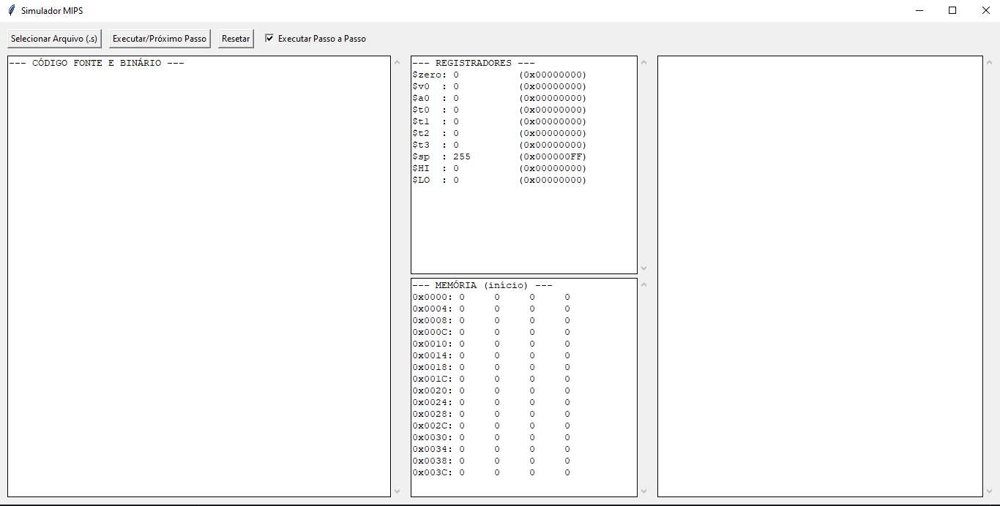

**Simulador MIPS com Interface Gráfica**
    Este projeto é um simulador para um subconjunto da arquitetura MIPS, desenvolvido em Python com uma interface
gráfica (GUI) utilizando a biblioteca Tkinter. A ferramenta foi criada para fins educacionais, permitindo visualizar a execução de código Assembly MIPS passo a passo, inspecionar o estado dos registradores, da memória e entender como as instruções são traduzidas para o formato binário.

**Funcionalidades Principais**
**Interface Gráfica Intuitiva**: Interaja com o simulador através de uma GUI simples para carregar arquivos, executar e resetar a simulação.

**Modos de Execução**:

    **Contínuo**: Executa o programa até o fim ou até encontrar uma syscall de término.

    **Passo a Passo**: Executa uma instrução por vez, permitindo uma análise detalhada do fluxo do programa.

**Visualização em Tempo Real**:

    **Registradores**: Monitore os valores de todos os registradores, incluindo $zero, $sp, $v0, $a0, $t0-$t3, $HI e $LO, com atualização a cada passo.

    **Memória**: Inspecione os primeiros 64 bytes da memória para observar o carregamento de dados e o comportamento da pilha.

    **Código Fonte e Binário**: Veja o código Assembly carregado ao lado de sua tradução para o formato binário (Tipo R e I), com um ponteiro >> indicando a próxima instrução a ser executada (PC).

**Carregamento de Arquivos .s**: Carregue facilmente seus arquivos de código Assembly MIPS através de um seletor de arquivos. O simulador processa as seções .data e .text.

**Tratamento de Erros**: O simulador é capaz de detectar e reportar diversos tipos de erros comuns, ajudando na depuração do código Assembly.

**Instruções Suportadas**
O simulador implementa um subconjunto essencial de instruções MIPS, incluindo:

| Tipo     | Instrução | Sintaxe de Exemplo            | Descrição                                                |
|----------|-----------|-------------------------------|----------------------------------------------------------|
| Tipo R   | `add`       | `add $t2, $t0, $t1`         | Soma dois registradores.                                 |
|          | `sub`       | `sub $t2, $t0, $t1`         | Subtrai dois registradores.                              |
|          | `and`       | `and $t2, $t0, $t1`         | Operação AND bit a bit.                                  |
|          | `or`        | `or $t2, $t0, $t1`          | Operação OR bit a bit.                                   |
|          | `slt`       | `slt $t2, $t0, $t1`         | Define como 1 se o primeiro for menor que o segundo.     |
|          | `sll`       | `sll $t2, $t0, 2`           | Deslocamento lógico para a esquerda.                     |
|          | `mult`      | `mult $t0, $t1`             | Multiplica dois registradores (resultado em $HI/$LO).    |
| Tipo I   | `addi`      | `addi $t0, $zero, 15`       | Soma um registrador com um valor imediato.               |
|          | `slti`      | `slti $t2, $t0, 20`         | Define como 1 se o registrador for menor que o imediato. |
|          | `lui`       | `lui $t2, 255`              | Carrega 16 bits superiores com um imediato.              |
|          | `lw`        | `lw $t1, 8($t0)`            | Carrega uma palavra da memória para um registrador.      |
|          | `sw`        | `sw $t2, 0($sp)`            | Salva uma palavra de um registrador na memória.          |
| Pseudo   | `la`        | `la $a0, minha_string`      | Carrega o endereço de um rótulo em um registrador.       |
| Sistema  | `syscall`   | `syscall`                   | Executa uma chamada ao sistema.                          |

**Syscalls Implementadas**
O simulador suporta as seguintes chamadas de sistema (definidas em $v0):

    Código 1: `print_int` - Imprime o valor inteiro contido no registrador $a0.

    Código 4: `print_string` - Imprime a string cujo endereço inicial está em $a0.

    Código 10: `exit` - Termina a execução do programa.

**Arquitetura Simulada**
O simulador utiliza uma arquitetura reduzida, com um número menor de registradores e uma "simulação" da memória de dados:

**Funcionamento no código**: 
    
    **Leitura do arquivo**: O código lê linha a linha separando o arquivo em tópicos que são tratados de maneira diferente, o tópico `.data` e `.text`, onde eles guardam endereços na memória de dados simulada e a outra tratada as linhas para transformar o código em uma <<matriz_programa>> que será usada para dividir as linhas do programa em instruções, registradores e valores.

    **Decodificação e execução**: O código recebe uma linha da <<matriz_programa>> que é representada pela váriavel `PC` que simula o endereço da instrução que será executada. O código identifica a instrução apartir de um dícionario de instruções e roda o tratamento da instrução separando os registradores nescessários e executando a operação que se pede. Ao fim da execução da instrução identificada a função retorna o "endereço da próxima instrução", que nessa simulação é o índice da próxima linha da nossa <<matriz_programa>>, `PC + 1`

    **Tradução Para Bin**: Existe uma função no código que recebe a instrução e segue uma série de dicionários para traduzir as instruções, registradores e valores imediatos

**Memória**: Um vetor de 256 bytes para dados e pilha.

**Registradores**: Um conjunto simplificado de 10 registradores de uso geral e especial:

`$zero`: Sempre zero.

`$v0`: Usado para valores de retorno de syscalls.

`$a0`: Usado para argumentos de syscalls.

`$t0 - $t3`: Registradores temporários.

`$sp`: Ponteiro de Pilha (Stack Pointer), inicializado no final da memória (255).

`$HI / $LO`: Registradores especiais para armazenar o resultado de 64 bits de operações de multiplicação.

**Como Usar**:

O Programa do *SIMULADOR MINIMIPS 32* já foi compilado e está pronto para uso!

    **Utilizando a Interface**
        **Selecionar Arquivo**: Clique no botão *"Selecionar Arquivo (.s)"* para carregar um dos arquivos de teste (teste-completo.s, teste_memoria.s, teste-erros.s) ou seu próprio código.

        **Executar**:

            Marque a caixa "Executar Passo a Passo" e clique em *"Executar/Próximo Passo"* para avançar uma instrução de cada vez.

            Desmarque a caixa para executar o programa inteiro de uma só vez.

        **Observar**: Acompanhe as mudanças nos painéis de Registradores, Memória, Código e Saída.

        **Resetar**: Clique no botão "Resetar" para limpar todos os registradores, memória e recarregar o programa do início.

**Arquivos de Teste Inclusos**
O projeto vem com três arquivos .s para demonstrar as funcionalidades do simulador:

**teste-completo.s**: Testa a maioria das instruções aritméticas, lógicas e de comparação implementadas. É um ótimo ponto de partida para ver o simulador em ação.

**teste_memoria.s**: Demonstra o uso da seção `.data` para armazenar strings e vetores, além de operações de empilhamento (`sw`) e desempilhamento (`lw`) usando o registrador `$sp`.

**teste_erros.s**: Contém deliberadamente vários tipos de erros para testar e demonstrar a capacidade de detecção e relatório de erros do simulador.